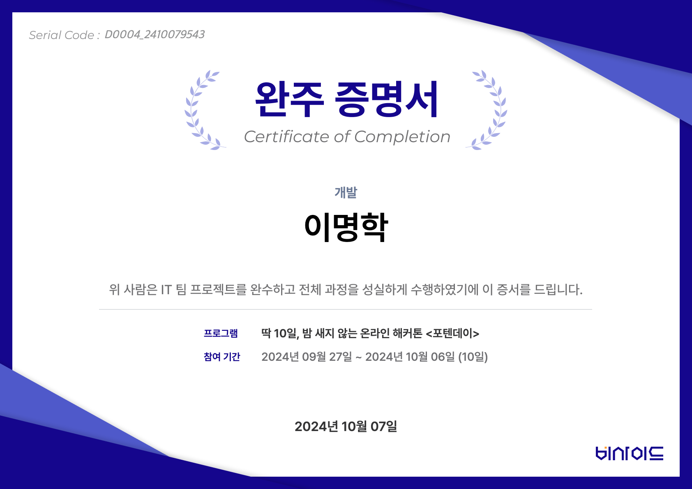

# 퍼플리💜

**나만의 플레이리스트로 나와 너를 알아보는 새로운 경험**

퍼플리는 소중한 사람들이 생각하는 '나'를 음악을 통해 알아볼 수 있는 새로운 경험을 제공합니다.

## 🎶 퍼플리란?

혹시 성격 유형 검사가 지겹지 않으신가요? 때로는 다른 사람들이 바라보는 나의 모습이 궁금하지 않으셨나요? 

퍼플리는 **음악을 통해 사람들이 나를 어떻게 바라보는지 알아보고, 그 모습들을 하나의 플레이리스트로 모아보는** 서비스입니다. 친구, 연인, 가족 등 소중한 사람들과 함께 서로를 생각하면 떠오르는 음악과 메시지를 주고받으며, 음악으로 마음을 표현하고 이해할 수 있는 새로운 기회를 만나보세요.

## 💜 퍼플리 사용법

1. **나의 플레이리스트 만들기**  
   퍼플리에 가입하고, 친구와 가족들이 바라보는 '나'를 표현할 수 있는 음악을 공유받으세요.

2. **서로의 마음 알아보기**  
   각자 상대방을 생각하며 가장 먼저 떠오르는 음악과 메시지를 선택해 보세요. 각자의 '너'라는 플레이리스트를 만들어 새로운 관점으로 서로를 알아갈 수 있습니다.

3. **음악으로 소통하기**  
   친구나 연인, 가족들이 생각하는 내가 어떤 모습일지 상상하며 나만의 플레이리스트를 감상하고 즐겨보세요.

## 🔗 퍼플리 소개서

퍼플리에 대해 더 자세히 알아보고 싶다면 [퍼플리 소개서](https://drive.google.com/file/d/1Vvj4AiXBg-tRw_mZpzyP7Gnm_kQMwcc_/view)를 확인해 보세요.

음악과 함께 새로운 시각으로 나를 알아가고, 서로를 이해하는 여정에 여러분을 초대합니다. 💜

